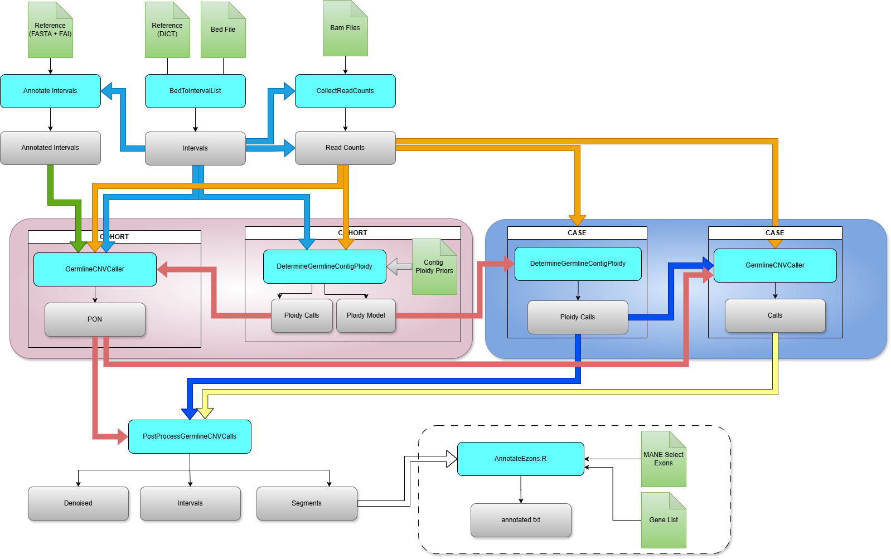

# nf-core/germlinecnv

[](https://www.nextflow.io/)
[](https://www.docker.com/)
[](https://sylabs.io/docs/)
[](https://docs.conda.io/en/latest/)

## Introduction

**nf-core/germlinecnv** is a bioinformatics pipeline for germline copy number variation (CNV) detection using GATK GermlineCNVCaller.

The pipeline is built using [Nextflow](https://www.nextflow.io), a workflow tool to run tasks across multiple compute infrastructures in a very portable manner. It follows [nf-core](https://nf-co.re) best practices and guidelines.

## Pipeline summary



1. **BedToIntervalList** - Convert BED file to interval list format
2. **CollectReadCounts** - Collect read counts for each sample (hybrid: reuses files from `--counts_dir` and runs only on missing samples)
3. **AnnotateIntervals** - Annotate intervals with GC content and mappability
4. **FilterIntervals** *(optional, `--use_filter_intervals`)* - Drop noisy bins from PON intervals
5. **DetermineGermlineContigPloidy** - Determine contig ploidy for all samples
6. **GermlineCNVCaller (COHORT)** - Generate Panel of Normals
7. **PON manifest** - Write `pon_manifest.json` (FASTA/BED md5, samples used, filter parameters)
8. **GermlineCNVCaller (CASE)** - Call CNVs per sample using PON
9. **PostprocessGermlineCNVCalls** - Generate VCFs and copy ratio files
10. **Validate PON manifest** *(optional, `--pon_manifest`)* - Check that case BED/FASTA match the PON
11. **Annotate CNVs** - Optional annotation with MANE transcripts, restricted to exons inside the capture BED

## Quick Start

1. Install [`Nextflow`](https://www.nextflow.io/docs/latest/getstarted.html#installation) (`>=23.04.0`)

2. Install any of [`Docker`](https://docs.docker.com/engine/installation/), [`Singularity`](https://www.sylabs.io/guides/3.0/user-guide/), [`Podman`](https://podman.io/), [`Shifter`](https://nersc.gitlab.io/development/shifter/how-to-use/) or [`Charliecloud`](https://hpc.github.io/charliecloud/) for full pipeline reproducibility

3. Download the pipeline and test it on a minimal dataset:

   ```bash
   nextflow run main.nf -profile test,docker --outdir results
   ```

4. Start running your own analysis:

   ```bash
   nextflow run main.nf \
       --input samplesheet.csv \
       --fasta /path/to/hg38.fa \
       --bed /path/to/targets.bed \
       --outdir results \
       -profile docker
   ```

## Documentation

### Input samplesheet

The pipeline requires a CSV samplesheet with the following format:

```csv
sample,bam,bai
sample1,/path/to/sample1.bam,/path/to/sample1.bam.bai
sample2,/path/to/sample2.bam,/path/to/sample2.bam.bai
```

| Column | Description |
|--------|-------------|
| `sample` | Sample identifier (must be unique) |
| `bam` | Full path to BAM file |
| `bai` | Full path to BAM index (optional, will look for .bam.bai if not provided) |

### Pipeline modes

The pipeline supports three execution modes:

#### 1. Full mode (default)

Generates a Panel of Normals and then runs all samples in CASE mode:

```bash
nextflow run main.nf \
    --input samplesheet.csv \
    --mode full \
    --fasta /path/to/hg38.fa \
    --bed /path/to/targets.bed \
    --outdir results \
    -profile docker
```

#### 2. PON mode

Only generates the Panel of Normals (useful for creating a reusable PON with normal samples):

```bash
nextflow run main.nf \
    --input normals.csv \
    --mode pon \
    --run_case_after_pon false \
    --fasta /path/to/hg38.fa \
    --bed /path/to/targets.bed \
    --outdir pon_results \
    -profile docker
```

#### 3. CASE mode

Runs samples against an existing PON (for processing new samples):

```bash
nextflow run main.nf \
    --input new_samples.csv \
    --mode case \
    --pon_model /path/to/pon_results/pon/pon-model \
    --ploidy_model /path/to/pon_results/ploidy/ploidy-model \
    --fasta /path/to/hg38.fa \
    --bed /path/to/targets.bed \
    --outdir case_results \
    -profile docker
```

If you already have count files:

```bash
nextflow run main.nf \
    --input new_samples.csv \
    --mode case \
    --pon_model /path/to/pon-model \
    --ploidy_model /path/to/ploidy-model \
    --counts_dir /path/to/counts \
    --outdir case_results \
    -profile docker
```

### Parameters

#### Required parameters

| Parameter | Description |
|-----------|-------------|
| `--input` | Path to samplesheet CSV |
| `--fasta` | Path to reference FASTA (with .fai and .dict) |
| `--bed` | Path to BED file with target regions |
| `--outdir` | Output directory |

#### Pipeline mode parameters

| Parameter | Default | Description |
|-----------|---------|-------------|
| `--mode` | `full` | Execution mode: `pon`, `case`, or `full` |
| `--run_case_after_pon` | `true` | Run CASE mode after PON generation |

#### CASE mode parameters

| Parameter | Description |
|-----------|-------------|
| `--pon_model` | Path to existing PON model directory |
| `--ploidy_model` | Path to existing ploidy model directory |
| `--counts_dir` | Directory with pre-computed counts. The pipeline auto-detects which samples already have counts (`{id}.hdf5`, `{id}.tsv`, `{id}.counts.hdf5`, `{id}.counts.tsv`) and runs `CollectReadCounts` only for the rest. |
| `--intervals` | Path to existing interval list (optional, used when generating counts for missing samples) |
| `--pon_manifest` | Optional `pon_manifest.json` from a previous PON run. If supplied, the case BED and FASTA md5 are verified against the PON. |
| `--strict_pon_validation` | `true` (default). When `false`, mismatches in the manifest validation only emit a warning instead of aborting. |

#### FilterIntervals parameters

`FilterIntervals` is run during PON generation by default to drop noisy bins. Disable it with `--use_filter_intervals false`.

| Parameter | Default | Description |
|-----------|---------|-------------|
| `--use_filter_intervals` | `true` | Enable FilterIntervals during PON generation |
| `--minimum_gc_content` | `0.1` | Minimum GC content per interval |
| `--maximum_gc_content` | `0.9` | Maximum GC content per interval |
| `--minimum_mappability` | `0.9` | Minimum mappability per interval |
| `--maximum_segmental_dup` | `0.5` | Max segmental duplication content |
| `--low_count_filter_count_threshold` | `5` | Reads below this are considered low |
| `--low_count_filter_percentage_of_samples` | `90.0` | % of samples that must be low-count to drop a bin |
| `--extreme_count_filter_minimum_percentile` | `1.0` | Lower percentile cutoff |
| `--extreme_count_filter_maximum_percentile` | `99.0` | Upper percentile cutoff |
| `--extreme_count_filter_percentage_of_samples` | `90.0` | % of samples that must be extreme to drop a bin |

#### Annotation parameters

| Parameter | Description |
|-----------|-------------|
| `--mane_file` | Path to MANE transcript file for annotation |
| `--genes_list` | Optional gene list (one symbol per line). If omitted, **no gene filter** is applied and all CNVs overlapping MANE exons are reported. |
| `--allosomal_contigs` | Allosomal contigs (default: `chrX`) |

The annotation step uses the capture BED to drop MANE exons that fall outside the panel before overlapping with CNV segments, so exons that were never callable (e.g. CHEK2 ex15 in some panels) are not reported as annotated.

#### Resource parameters

| Parameter | Default | Description |
|-----------|---------|-------------|
| `--max_cpus` | 10 | Maximum CPUs per process |
| `--max_memory` | 128.GB | Maximum memory per process |
| `--max_time` | 240.h | Maximum time per process |

### Output

```
results/
├── intervals/
│   ├── intervals.interval_list
│   ├── annotated_intervals.tsv
│   └── filtered_intervals.interval_list      # only if --use_filter_intervals (default)
├── counts/
│   └── *.counts.tsv | *.counts.hdf5
├── ploidy/
│   ├── ploidy-calls/
│   └── ploidy-model/
├── cnv/                                       # GermlineCNVCaller cohort/case output
│   └── ...
├── pon/                                       # PON metadata
│   ├── pon_manifest.json
│   └── pon_samples.tsv
├── results/
│   └── {sample}/
│       ├── {sample}_denoised_copy_ratios.tsv
│       ├── {sample}_intervals.vcf.gz
│       └── {sample}_segments.vcf.gz
├── annotated/
│   └── {sample}/
│       └── {sample}_annotated.txt
└── pipeline_info/
    ├── validation_report.txt                  # only if --pon_manifest is given in case mode
    ├── execution_report_*.html
    ├── execution_timeline_*.html
    ├── execution_trace_*.txt
    ├── pipeline_dag_*.svg
    └── software_versions.yml
```

### PON manifest

When PON generation runs, the pipeline writes a `pon_manifest.json` under `outdir/pon/` documenting the run:

```json
{
  "pipeline_version": "1.0.0",
  "created_at": "2026-04-29T14:23:11-03:00",
  "reference":  { "fasta_path": "...", "fasta_md5": "..." },
  "intervals":  { "bed_path": "...", "bed_md5": "...",
                  "preprocessed_intervals_md5": "...",
                  "filtered_intervals_md5": "..." },
  "filter_intervals": { "enabled": true, "params": { "minimum_gc_content": 0.1, ... } },
  "samples": [ { "id": "S001", "counts_source": "computed" },
               { "id": "S002", "counts_source": "reused" } ]
}
```

In CASE mode, pass `--pon_manifest /path/to/pon_manifest.json` to verify that the BED and FASTA used for the case match those of the PON. If they differ, the run aborts (or emits a warning when `--strict_pon_validation false`).

## Pipeline structure

```
germlinecnv/
├── main.nf                          # Entry point
├── nextflow.config                  # Main configuration
├── nextflow_schema.json             # Parameter schema
├── workflows/
│   └── germlinecnv.nf              # Main workflow
├── subworkflows/
│   └── local/
│       ├── generate_pon/           # PON generation subworkflow
│       ├── call_cnv_case/          # CASE calling subworkflow
│       └── utils_nfcore_*/         # Utility subworkflows
├── modules/
│   └── local/
│       ├── gatk4/
│       │   ├── bedtointervallist/
│       │   ├── collectreadcounts/
│       │   ├── determinegermlinecontigploidy/
│       │   ├── annotateintervals/
│       │   ├── germlinecnvcaller_cohort/
│       │   ├── germlinecnvcaller_case/
│       │   └── postprocessgermlinecnvcalls/
│       ├── annotate_cnv_vcfs/
│       └── custom/
│           └── dumpsoftwareversions/
├── conf/
│   ├── base.config                 # Base resource configuration
│   ├── modules.config              # Module-specific configuration
│   ├── test.config                 # Test profile
│   └── test_full.config            # Full test profile
├── assets/
│   ├── contig_ploidy_priors.tsv   # Default ploidy priors
│   ├── schema_input.json          # Samplesheet schema
│   └── samplesheet.csv            # Example samplesheet
├── bin/
│   └── exon_annotation.R          # Annotation script
└── docs/
    └── usage.md                    # Detailed usage documentation
```

## Typical clinical workflow

### 1. Initial PON creation (once)

Create a PON using your laboratory's normal samples:

```bash
nextflow run main.nf \
    --input normals.csv \
    --mode pon \
    --run_case_after_pon false \
    --fasta /references/hg38.fa \
    --bed /panels/trusight_cancer.bed \
    --outdir /lab/pon_trusight \
    -profile singularity
```

### 2. Process patient samples

Run new patient samples against your established PON. Optionally validate against the PON manifest:

```bash
nextflow run main.nf \
    --input patient_batch.csv \
    --mode case \
    --pon_model /lab/pon_trusight/cnv_calls/cohort-cnv-model/cohort-model \
    --ploidy_model /lab/pon_trusight/ploidy/cohort-model \
    --pon_manifest /lab/pon_trusight/pon/pon_manifest.json \
    --fasta /references/hg38.fa \
    --bed /panels/trusight_cancer.bed \
    --mane_file /annotations/MANE.GRCh38.txt \
    --counts_dir /lab/counts_cache \
    --outdir /results/batch_2024_01 \
    -profile singularity
```

Samples already present in `--counts_dir` are reused; missing ones are computed on the fly.

## Bundling references in a Docker image

The repo ships `build_references_image.sh` and `Dockerfile.references` to package the reference genome, capture BED and a generated PoN into a single tagged image (`germlinecnv-references:<tag>`). Useful for shipping a reproducible reference snapshot to other machines or collaborators.

See [`docs/build_references.md`](docs/build_references.md) for the full walkthrough (configuring source paths, building, verifying, using in `--mode case`, versioning).

## Troubleshooting

### Common issues

1. **Missing BAI files**: Ensure index files exist as either `sample.bam.bai` or `sample.bai`

2. **Memory errors**: Increase memory limits:
   ```bash
   nextflow run main.nf --max_memory 256.GB ...
   ```

3. **Resume failed runs**: Use the `-resume` flag:
   ```bash
   nextflow run main.nf -resume ...
   ```

4. **Docker permission issues**: The docker profile includes user emulation. If issues persist:
   ```bash
   nextflow run main.nf -profile docker --docker.runOptions '-u $(id -u):$(id -g)' ...
   ```

## Credits

nf-core/germlinecnv was originally written by the bioinformatics team.

## Citations

If you use nf-core/germlinecnv for your analysis, please cite:

- **GATK**: McKenna A, et al. The Genome Analysis Toolkit: a MapReduce framework for analyzing next-generation DNA sequencing data. Genome Res. 2010;20(9):1297-1303.

- **Nextflow**: Di Tommaso P, et al. Nextflow enables reproducible computational workflows. Nat Biotechnol. 2017;35(4):316-319.

## License

This pipeline is released under the MIT License.
